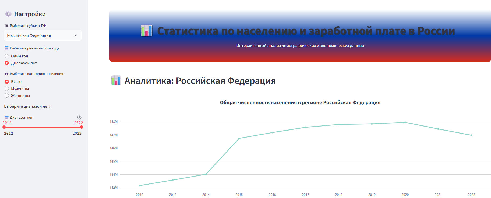

# 📊 Статистика по населению и заработной плате в России

Интерактивное веб-приложение для анализа демографических и экономических данных Российской Федерации основанно на данных Росстата.



## 🎯 Описание

Приложение предоставляет комплексный анализ статистических данных по населению и заработной плате в России с возможностью:

- **Демографический анализ**: численность населения по возрастным группам и полу
- **Экономический анализ**: динамика заработной платы по регионам
- **Интерактивная визуализация**: графики, диаграммы и таблицы
- **Фильтрация данных**: по субъектам РФ, годам и категориям населения

## ✨ Основные возможности

### 📈 Анализ населения

- Общая численность населения по регионам
- Распределение по возрастным группам:
  - Моложе трудоспособного возраста
  - В трудоспособном возрасте
  - Старше трудоспособного возраста
- Детальное распределение по возрасту (0-100 лет)
- Анализ по полу (мужчины/женщины)

### 💰 Анализ заработной платы

- Средняя заработная плата по годам
- Заработная плата по кварталам
- Заработная плата по месяцам
- Сравнительный анализ между регионами

### 📊 Типы визуализации

- **Линейные графики** - для отображения динамики показателей
- **Столбчатые диаграммы** - для сравнения значений
- **Диаграммы с областями** - для отображения структуры данных
- **Круговые диаграммы** - для пропорционального представления

## 🚀 Установка и запуск

### Локальная установка

1. **Клонируйте репозиторий:**

```bash
git clone https://github.com/your-username/stream1.git
cd stream1
```

2. **Установите зависимости:**

```bash
pip install -r requirements.txt
```

3. **Запустите приложение:**

```bash
streamlit run app.py
```

4. **Откройте браузер** и перейдите по адресу: `http://localhost:8501`

### Запуск через Docker

1. **Соберите образ:**

```bash
docker build -t stream1-app .
```

2. **Запустите контейнер:**

```bash
docker run -p 8501:8501 stream1-app
```

### Запуск через Docker Compose

```bash
docker-compose up --build
```

## 🎮 Использование

### 1. Выбор региона

В боковой панели выберите субъект Российской Федерации из выпадающего списка.

### 2. Настройка периода

- **Один год**: выберите конкретный год для анализа
- **Диапазон лет**: выберите период для изучения динамики

### 3. Выбор категории населения

- **Всего** - общая численность
- **Мужчины** - только мужское население
- **Женщины** - только женское население

### 4. Анализ данных

- **Для одного года**: отображаются таблицы с детальными данными
- **Для диапазона лет**: создаются интерактивные графики

### 5. Настройка визуализации

- Выберите тип графика (линейный, столбчатый, с областями)
- Настройте отображаемые возрастные группы
- Выберите кварталы/месяцы для анализа зарплаты

## 🛠️ Технические особенности

### Архитектура

- **Frontend**: Streamlit для интерактивного интерфейса
- **Визуализация**: Plotly для создания интерактивных графиков
- **Обработка данных**: Pandas для манипуляции с данными
- **Стилизация**: CSS для кастомного дизайна

### Производительность

- Кэширование данных с помощью `@st.cache_data`
- Оптимизированная загрузка CSV файлов
- Эффективная фильтрация данных

### Безопасность

- Валидация входных данных
- Обработка ошибок при загрузке файлов
- Проверка существования данных

## 🤝 Вклад в проект

1. Форкните репозиторий
2. Создайте ветку для новой функции
3. Внесите изменения и создайте pull request

## 📝 Лицензия

Этот проект распространяется под лицензией MIT. См. файл `LICENSE` для подробностей.

## 📞 Поддержка

Если у вас есть вопросы или предложения, создайте issue в репозитории или свяжитесь с автором.

---

**Версия**: 2.0  
**Последнее обновление**: 2024  
**Данные**: По состоянию на 2022 год
